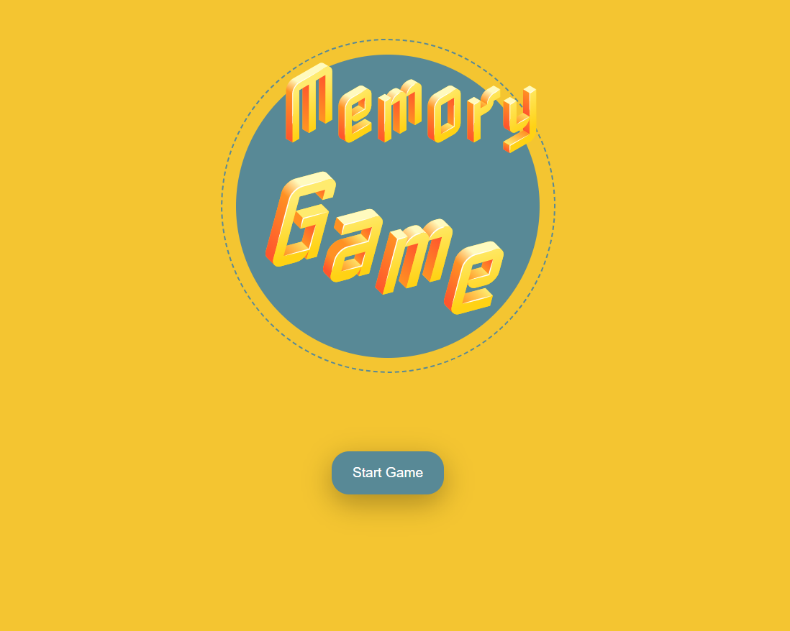

<h1>✨Memory Game</h1>

<h2>💻 Projeto</h2>

O jogo da memória é um jogo com peças que apresentam uma figura em um dos lados, é formado por um baralho de cartas ilustradas e duplicada com cada
  figura se repetindo em duas peças diferentes. Encontrando todos os seus respectivos pares, o jogador vence.

  
<h2>✨ Tecnologias</h2>
<ul class="contains-task-list">
<li class="task-list-item"><input type="checkbox" id="" disabled="" class="task-list-item-checkbox"> HTML </li>
<li class="task-list-item"><input type="checkbox" id="" disabled="" class="task-list-item-checkbox"> CSS</li>
<li class="task-list-item"><input type="checkbox" id="" disabled="" class="task-list-item-checkbox"> JavaScript</li>
</ul>
